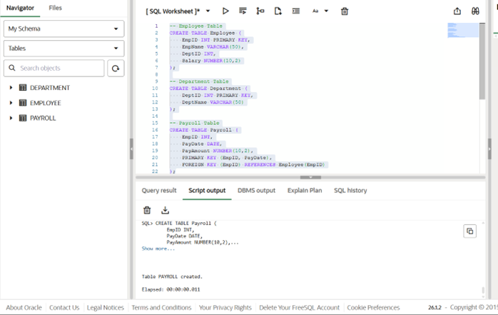
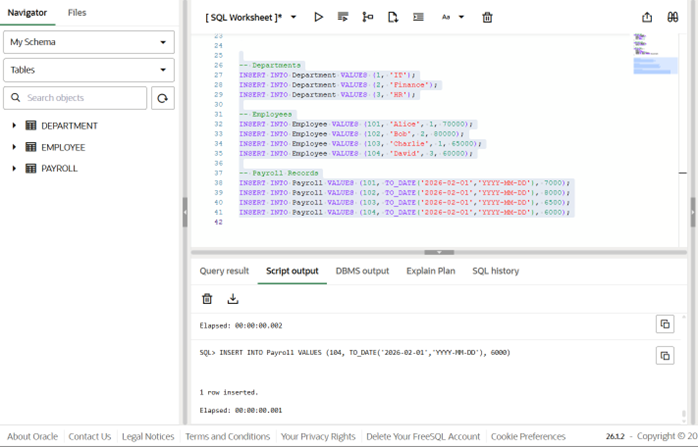
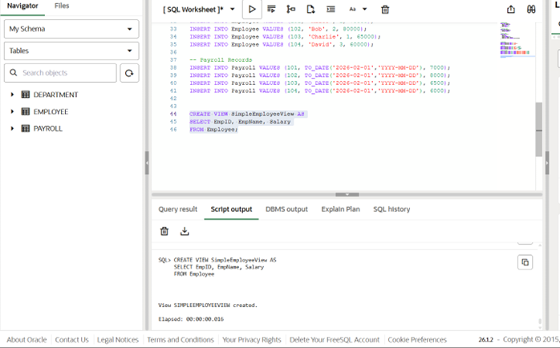
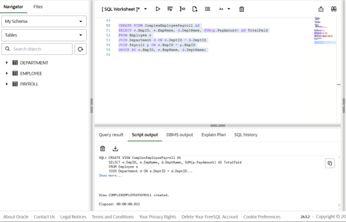
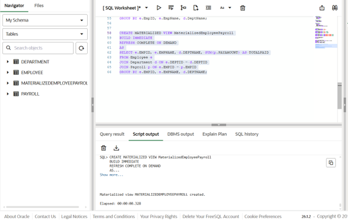
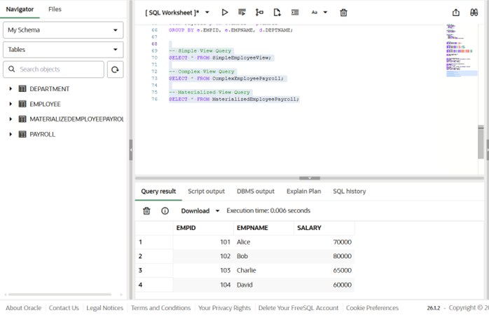
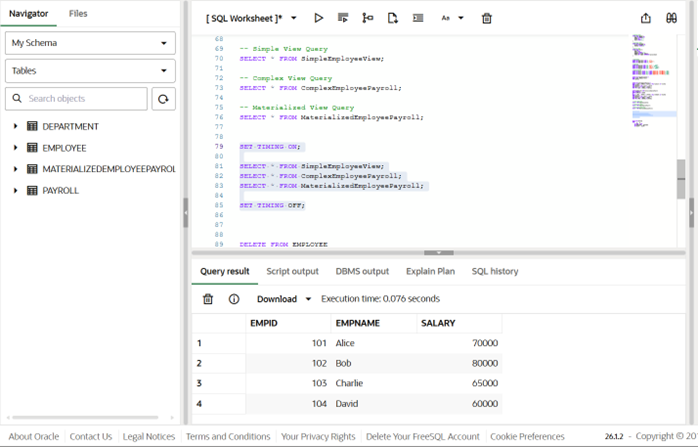

# Experiment 7 – Design and Performance Analysis of Materialized Views (SanDisk, JTG, PayPal)

## Experiment
**Experiment 7:** Creating and analyzing simple views, complex views, and materialized views to compare execution time and performance differences. This experiment demonstrates query optimization and system performance evaluation in a database environment.

---

## Aim
To design and implement a materialized view and to compare and analyze execution time and performance differences between simple views, complex views, and materialized views, thereby understanding their impact on query optimization and system performance.

---

## Objective
- To create simple views, complex views, and materialized views.  
- To evaluate and compare execution time for different views.  
- To highlight the advantages of materialized views in enterprise-level applications.  
- To analyze the performance benefits of materialized views in data-intensive scenarios.  

---

## Software Requirements

### Database Management System:
- Oracle Database Express Edition (Oracle XE)  
- PostgreSQL Database  

### Database Administration Tool / Client Tool:
- Oracle SQL Developer (for Oracle XE)  
- pgAdmin (for PostgreSQL)  

---

## Problem Statement
In large-scale enterprise systems, frequent execution of complex queries can significantly affect performance. Organizations require optimized mechanisms to improve query response time without compromising data consistency.

---

## Practical / Experiment Steps
1. Create a simple view based on a single employee-related table.  
2. Create a complex view involving joins, filters, or aggregations.  
3. Create a materialized view storing precomputed query results.  
4. Execute queries on all three types of views.  
5. Analyze and compare execution time and performance to determine the most efficient approach for repeated query execution.  

---

## Procedure
1. Open Oracle SQL Developer or pgAdmin and connect to the database.  
2. Create the base tables (e.g., employee, department, payroll).  
3. Insert sample data into the tables.  
4. Create a **simple view** selecting a subset of columns from a single table.  
5. Create a **complex view** using JOINs, aggregations, and filters.  
6. Create a **materialized view** to store the results of a complex query.  
7. Execute `SELECT` queries on all views and record execution times.  
8. Compare performance metrics between simple, complex, and materialized views.  
9. Capture results and screenshots for documentation.  

---

## Input / Output Details

### Input
**Base tables:**  
- employee (id, name, department_id, salary)  
- department (id, name)  
- payroll (employee_id, salary, bonus)  

**Views:**  
- Simple view: SELECT columns from a single table  
- Complex view: JOIN, aggregation, filters  
- Materialized view: Precomputed query results  

---

## Step-wise Output
**Step 1 – Create Base Tables**  

**Step 2 – Insert Sample Data**  

**Step 3 – Create Simple View**  

**Step 4 – Create Complex View**  

**Step 5 – Create Materialized View**  
 

**Step 6 – Execute Queries on Views**  

**Step 7 – Compare Performance**  

---

## Learning Outcome
After completing this experiment, the learner will be able to:  
- Understand the concept and working of materialized views in a database system.  
- Differentiate between simple views, complex views, and materialized views.  
- Create and refresh materialized views in PostgreSQL/Oracle.  
- Measure and compare query execution time for different types of views.  
- Analyze performance benefits of materialized views in data-intensive applications.  
- Apply materialized view concepts in real-world scenarios like SanDisk, JTG, and PayPal.x