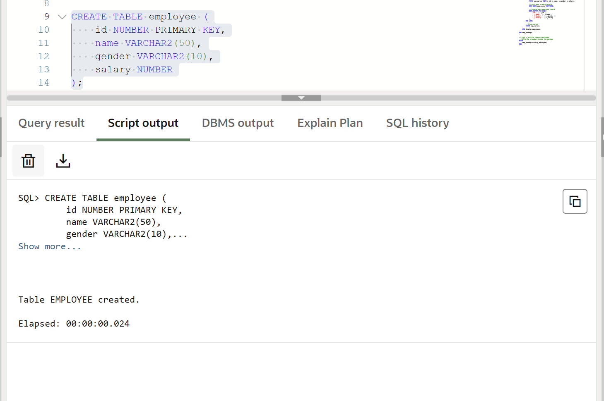
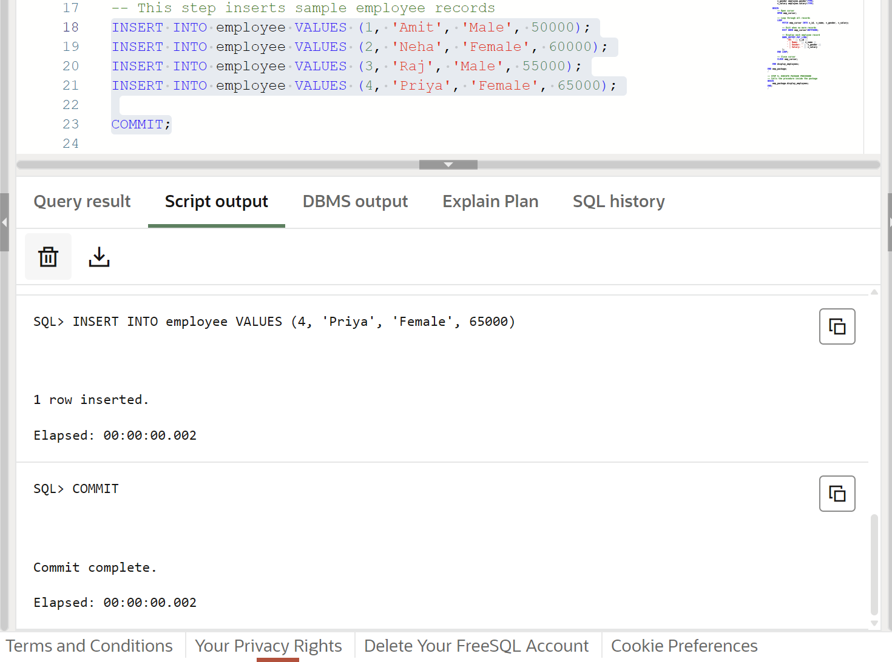
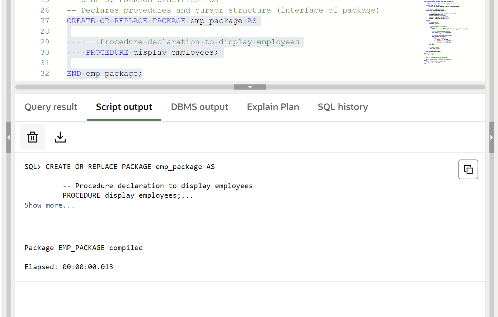
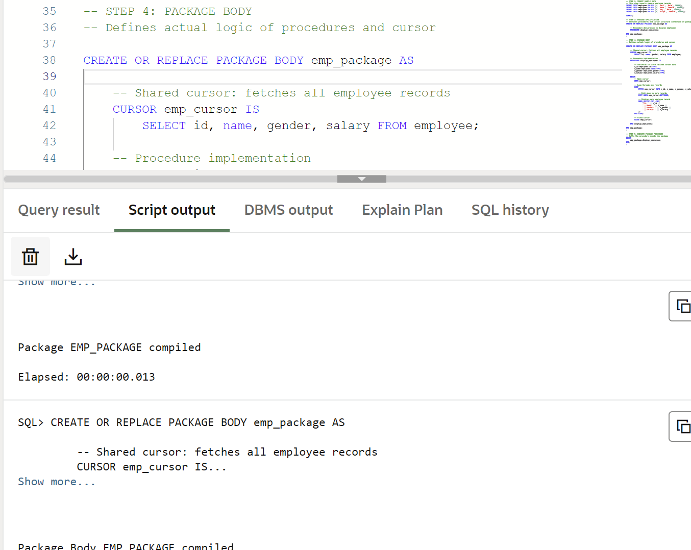
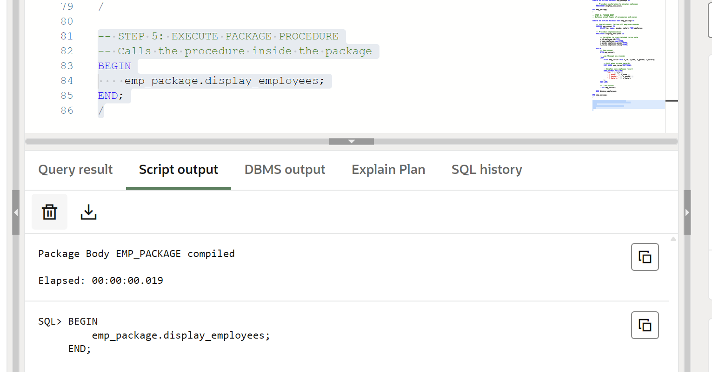

# Experiment 9 – Design of a PL/SQL Package with Procedures and Shared Cursor (Enterprise Applications)

## Experiment  
Designing and implementing a PL/SQL package that contains procedures and a shared cursor to fetch and display employee details. This experiment demonstrates modular programming, code reusability, and efficient data handling using packages in PL/SQL.

---

## Aim  
To create and implement a PL/SQL package consisting of a package specification and package body that includes procedures and a shared cursor for retrieving and displaying employee data.

---

## Objective  
- To understand the concept and structure of PL/SQL packages  
- To differentiate between package specification and package body  
- To implement procedures inside packages  
- To use shared cursors for efficient data retrieval  
- To develop modular and reusable database programs  

---

## Software Requirements  

Database Management System:  
Oracle Database Express Edition (Oracle XE) / PostgreSQL  

Database Administration Tool:  
Oracle SQL Developer / pgAdmin  

---

## Problem Statement  
In enterprise-level database applications, related operations must be grouped together for better maintainability, performance, and reusability. A PL/SQL package provides a structured approach to organize procedures and shared cursors, ensuring efficient data retrieval and modular program design.

---

## Practical / Experiment Steps  
1. Create an employee table with relevant attributes  
2. Insert sample data into the table  
3. Create package specification declaring procedures and cursor  
4. Create package body defining logic for procedures and cursor  
5. Use a shared cursor to fetch employee records  
6. Execute the package procedure  
7. Display the output  

---

## Procedure  
1. Open Oracle SQL Developer and connect to the database  
2. Create the employee table   
3. Insert sample records   
4. Create package specification  
5. Create package body  
6. Compile the package successfully  
7. Execute package procedure  
8. Display employee details output  

---

## Input / Output Details  

### Input  
Table: employee (id, name, gender, salary)

---

## Step-wise Output  

### Step 1 – Create Employee Table  

### Step 2 – Insert Sample Data  

### Step 3 – Create Package Specification  

### Step 4 – Create Package Body  

### Step 5 – Execute Package Procedure  

---

## Learning Outcome  
After completing this experiment, the learner will be able to:

- Understand the structure of PL/SQL packages  
- Create package specification and package body  
- Use shared cursors inside packages  
- Implement modular and reusable database logic  
- Apply package concepts in enterprise applications